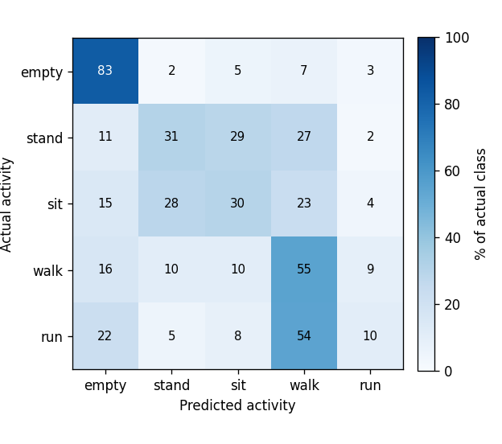
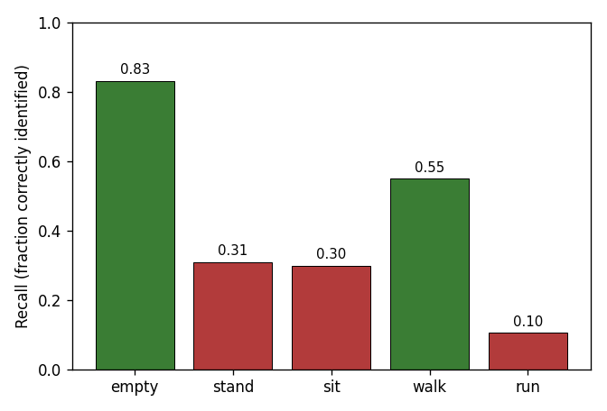
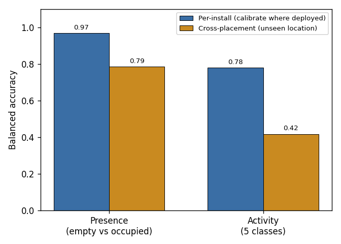
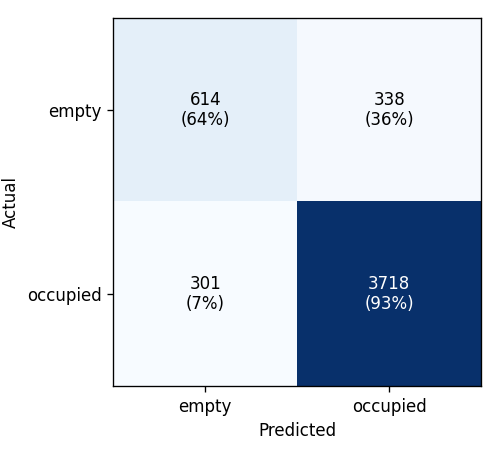
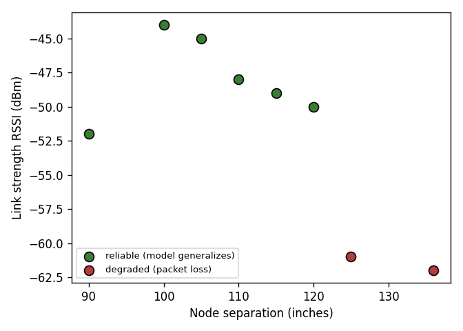
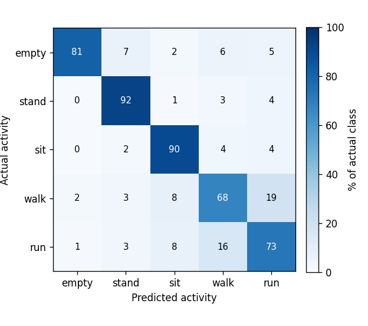

# CSI Occupancy & Activity Model — Visual Summary

The model is a random forest trained on **all good (strong-link) data pooled
together**, using calibrated per-configuration features (each location is
referenced against a short empty-room capture). Two weak-link configurations were
excluded because the radio link had degraded past the usable range (see Figure 5).

All figures report **held-out (cross-placement) performance** — the model is
tested on placements it did not train on — except where "per-install" is stated.
Data was collected across **Library Study Room 320X** (multiple placements and
node orientations).

## Dataset (as recorded)

| | |
|---|---|
| Configurations (placement × orientation) | 14 |
| Recording sessions | 29 |
| Total recording time | ~2.7 hours (160 min) |
| CSI packets logged | 910,071 |
| Labeled 2-second analysis windows | 4,971 |
| Classes | empty, stand, sit, walk, run |

---

## Figure 1 — Activity confusion matrix

Each row is the true activity; each cell shows the percentage of that activity's
windows predicted as each class (rows sum to 100%). The strong diagonal cell for
**empty (83%)** shows the model reliably knows when the room is unoccupied. The
weaknesses are visible off-diagonal: **stand and sit are confused with each
other** (both are motionless, so they look alike to a single antenna), and
**run is mostly absorbed into walk** (both are whole-body motion). This is the
clearest single picture of where the model is strong and where it struggles.

## Figure 2 — Per-activity recall

Recall is the fraction of each activity the model correctly identifies. **Empty
(0.83) and walk (0.55)** are recognized well; **stand (0.31), sit (0.30) and run
(0.10)** are the weak classes when generalizing to a new placement. The pattern
matches the confusion matrix: the model separates *presence* and *gross motion*
well, but the fine distinctions between similar postures/speeds do not transfer
across locations from training alone.

## Figure 3 — Per-install vs. cross-placement

This is the most important result. **Per-install** (blue) means the model is
calibrated at the location where it runs — the realistic deployment mode.
**Cross-placement** (orange) means it is trained elsewhere and dropped into an
unseen location. Presence stays strong either way (0.97 → 0.79), so **occupancy
detection is portable**. Activity classification is excellent when calibrated
on-site (0.78) but falls to 0.42 across unseen placements — so **fine activity
recognition currently needs a short on-site calibration**, it does not yet
transfer for free.

## Figure 4 — Presence confusion matrix

A simple two-way view of the strongest capability: empty vs. occupied. Each cell
shows the window count and, in parentheses, the percentage of that actual class.
Occupied rooms are caught almost always; the residual error is occasionally
calling a truly empty room "occupied," which comes from a motionless person being
hard to distinguish from an empty room — the same effect seen in Figure 1.

## Figure 5 — Link range limit

A hardware characterization: link strength (RSSI) versus the distance between the
two nodes. Below ~**120 inches** the link is strong and the model generalizes
(green); beyond ~120–125 inches the signal drops below about −60 dBm, packets
start dropping heavily, and performance collapses (red). This is a concrete
deployment guideline — keep the two nodes within ~120 inches (about 10 ft) — and
it is why the two farthest configurations were excluded from the model.

## Figure 6 — Activity confusion, block-recording protocol only (per-install)

This isolates the **long-block recording protocol** (each activity recorded as
one continuous 2-minute block, giving balanced, clean data) evaluated
**per-install** (calibrated on-site). It is the fair picture of what the model
can do for activity when the data protocol is consistent: the diagonal is strong
across the board — **stand 92%, sit 90%, run 73%, empty 81%** — with the only
notable confusion between **walk and run (68%)**, which is expected since both are
whole-body motion differing mainly in speed. Balanced accuracy is **0.81**.
Compared with Figure 1 (all protocols pooled, cross-placement), this shows the
weak stand/sit/run classes there are largely a *cross-placement transfer* and
*mixed-protocol* effect — not an inability of the sensor to tell the activities
apart when calibrated on-site with consistent data.

---

## Summary of strengths and weaknesses

**Strengths**
- Presence (occupied vs. empty) is reliable and **portable across placements** (0.79 balanced held-out; ~0.97 per-install).
- Activity classification is strong **when calibrated on-site** (0.78 balanced).
- The usable operating range of a single link is now quantified (~120 in).

**Weaknesses**
- Fine activity does **not** transfer to unseen placements without on-site calibration (0.42 balanced).
- **Stand vs. sit** (two still postures) and **run vs. walk** (two motions) are the specific confusions.
- Telling an empty room from a **motionless person** is the hardest presence case.

These weaknesses all stem from a single antenna seeing the room from one angle;
they are the motivation for adding a second and third receiver.
