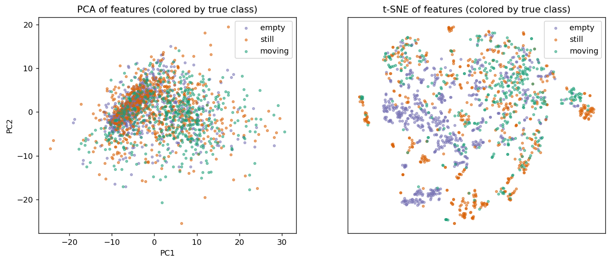
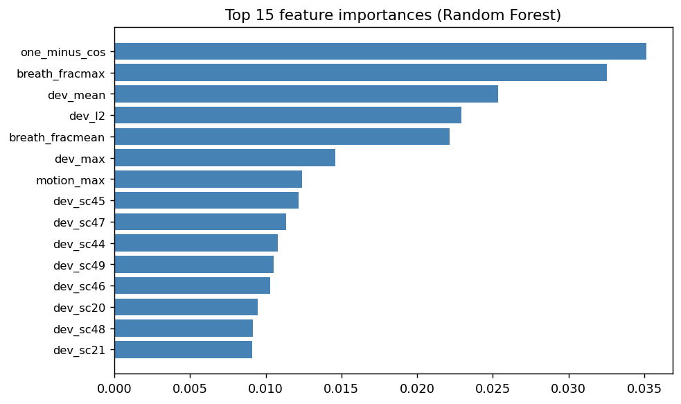

# Model statistics & clustering report

_Preliminary — current single-link dataset. Regenerate on the rigorous multi-orientation dataset._

```
================================================================
DATASET & FEATURE SET
================================================================
Windows: 1944   per-class: {np.str_('still'): 649, np.str_('moving'): 519, np.str_('empty'): 776}
Takes: 12   environments: [np.str_('confA'), np.str_('confA_o2'), np.str_('confA_o3')]
Features: 168  (52 active subcarriers x 3 [deviation, std, motion] + 8 summary + 4 low-freq)

================================================================
PER-CLASS MEANS  (interpretable summary features, pre-calibration)
================================================================
feature                empty     still    moving
dev_mean               0.066     0.154     0.121
dev_max                0.261     0.534     0.427
dev_l2                 0.673     1.531     1.193
one_minus_cos          0.002     0.009     0.006
std_mean               1.094     1.115     1.218
std_max                1.424     1.423     1.554
motion_mean            0.137     0.184     0.260
motion_max             0.209     0.295     0.405
breath_fracmean        0.038     0.080     0.092
breath_fracmax         0.075     0.154     0.165
breath_peakmean        2.566     2.576     2.619
breath_peakmax         4.001     3.969     4.041

================================================================
TOP 15 FEATURE IMPORTANCES (Random Forest, 3-class)
================================================================
  one_minus_cos    0.0351
  breath_fracmax   0.0325
  dev_mean         0.0253
  dev_l2           0.0229
  breath_fracmean  0.0221
  dev_max          0.0146
  motion_max       0.0124
  dev_sc45         0.0122
  dev_sc47         0.0113
  dev_sc44         0.0108
  dev_sc49         0.0105
  dev_sc46         0.0103
  dev_sc20         0.0095
  dev_sc48         0.0091
  dev_sc21         0.0091

================================================================
UNSUPERVISED CLUSTERING (do the classes form natural clusters?)
================================================================
KMeans(k=3) vs true labels:  ARI=0.052  NMI=0.048  silhouette=0.174
PCA explained variance (2 comps): 56.2%
(ARI/NMI near 0 = classes overlap in feature space; near 1 = cleanly separable)

Saved slides_assets/clusters.png, slides_assets/feature_importance.png
```




